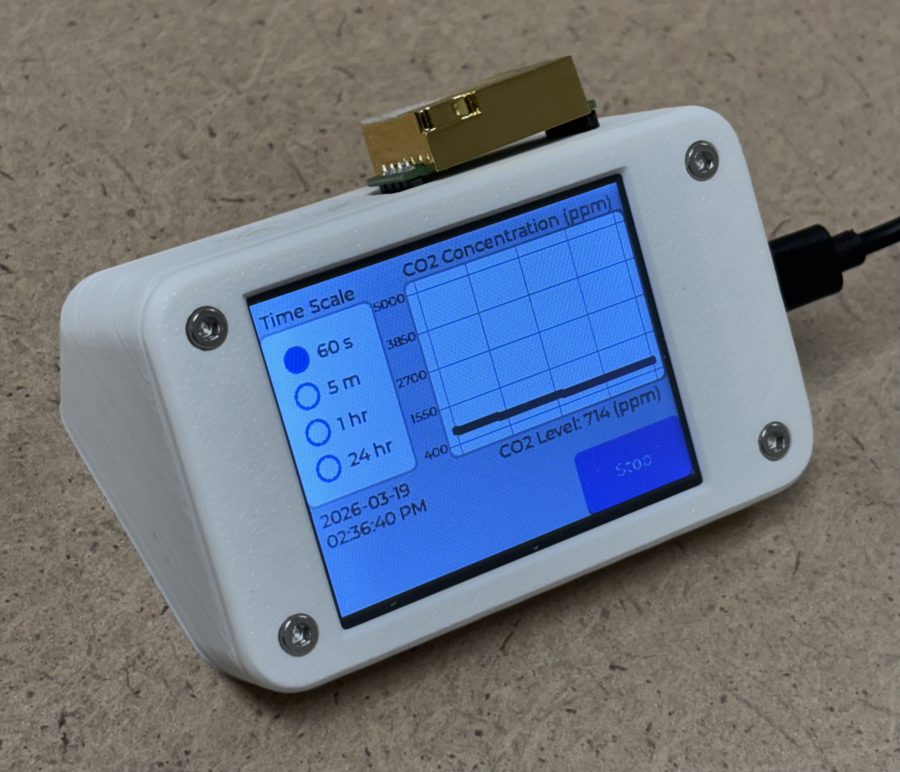
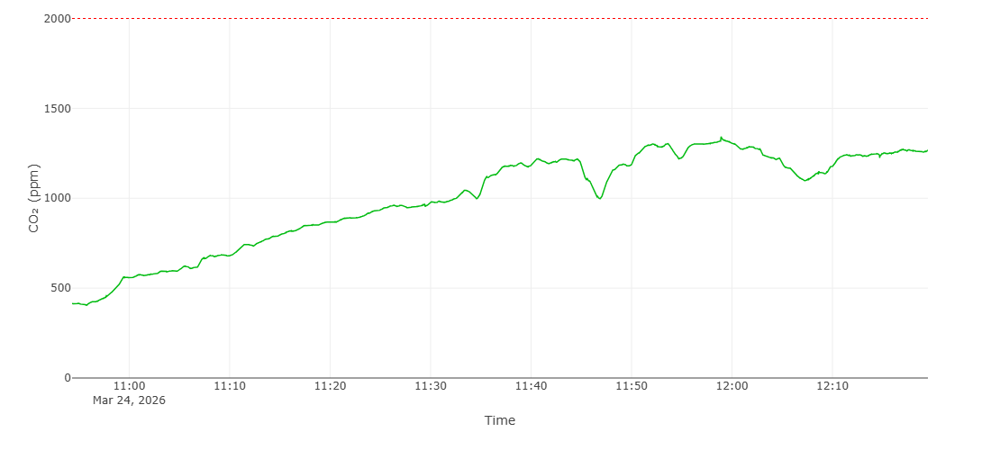

# CO2 Monitor



### Description
An ESP32-based CO2 monitor that logs readings to a SQLite database and displays them through a Django web application.

### Impact
[Studies](https://www.sciencedirect.com/science/article/pii/S036013232300358X) have shown that short-term exposure to high levels of CO2 can reduce cognitive performance and negatively impact learning. Therefore, it is important to be ensure that CO2 levels remain low in an academic setting.

### Components
MH-Z19C CO2 Sensor ([more info](https://www.winsen-sensor.com/d/files/infrared-gas-sensor/mh-z19c-pins-type-co2-manual-ver1_0.pdf)) \
[by EC Buying](https://www.amazon.com/EC-Buying-Monitoring-Concentration-Detection/dp/B0CRKH5XVX)

ESP32 Cheap Yellow Display ([more info](https://www.lcdwiki.com/2.8inch_ESP32-32E_Display))\
[by Hosyond](https://www.amazon.com/gp/product/B0D92C9MMH)

### Features
* Screen automatically sleeps after 5 minutes of inactivity
* Zero the CO2 sensor to 400 ppm by depressing the button for 7 seconds (only do this when outdoors)

### Dependencies
* Django for web app, API endpoint, and SQLite database
* LVGL for ESP-32 GUI
* TFT_eSPI
* XPT2046_Touchscreen
ESP32 CYD GUI configuration files can be found in [this guide](https://randomnerdtutorials.com/lvgl-cheap-yellow-display-esp32-2432s028r)

### Data Collection and Upload

Samples will be taken every 1 second. The timestamp will be updated after each data POST request to keep the timestamps accurate over long periods of time. POST requests will be made every 4 minutes to reduce power usage and live data is already displayed on the CYD. A SQLite database hosted in the cloud will be used to store the data.

#### `POST /api/log/`

Logs one or more CO2 readings to the database.

**Authentication:** Bearer token via `Authorization` header (set `CO2_API_TOKEN` in `.env`)

**Request body:** A single JSON object or an array of objects:
```json
[
  {"mode": "ambient", "building": "COE", "room_number": 306, "unix_timestamp": 1678886400, "CO2_ppm": 750},
  {"mode": "ambient", "building": "COE", "room_number": 306, "unix_timestamp": 1678886401, "CO2_ppm": 760}
]
```

| Field | Type | Max Length | Description |
|-------|------|------------|-------------|
| `mode` | string | 50 chars | `"ambient"` or `"session"` |
| `building` | string | 30 chars | Building identifier (e.g. `"COE"`) |
| `room_number` | string | 10 chars | Room number (e.g. "301A")|
| `unix_timestamp` | int |  | Unix timestamp of the reading |
| `CO2_ppm` | int |  | CO2 concentration in parts per million |

**Responses:**

| Status | Meaning |
|--------|---------|
| `201` | Success — returns `{"success": true, "records_saved": N}` |
| `400` | Malformed JSON or missing field |
| `401` | Missing or invalid token |

### Pinout
| Pin | Use |
|-----|-----|
| IO35 | PWM for CO2 Sensor |
| 5V (UART PORT) | Vin for CO2 Sensor |
| GND | GND for CO2 Sensor |
| GND | GND for button -> CO2 Sensor HD Pin |

### CAD
Modified [ghfisanotti's CYD Case on Thingiverse](https://www.thingiverse.com/thing:7047135), licensed under CC BY-SA 3.0. See CAD folder in this repo for the STL and STEP files. 

### Required Parts and Assembly
* 1x ESP-32 CYD
* 1x MH-Z19C CO2 Sensor
* 2x 1.25mm 4-pin JST to Dupont connectors
* 1x CYD_LID (3D printed)
* 1x CYD_BASE (3D printed)
* 4x M3 heat-set inserts
* 4x M3x8 bolts
* 1x [push button](https://www.amazon.com/Waterproof-Momentary-Button-Switch-Colors/dp/B07F24Y1TB) *optional, for zeroing the sensor
* 1x 5-pin female pin header *optional, for securing the sensor to the base

The 5-pin female pin header is secured by melting the plastic around it with a soldering iron. On the female pin header that the MH-Z19C's HD pin will plug into, solder a wire (this will connect to one pin of the button). Connect the other pin of the button to a GND pin on the CYD.

###  How to run
Clone this repo
```bash
git clone https://github.com/NathanPervin/ESP32-CO2-Monitor.git
```
```bash
cd ESP32-CO2-Monitor
```

Create a virtual environment
```bash
python -m venv venv
```

Start virtual environment
```bash
source venv/bin/activate
```

Install dependencies
```bash
pip install -r requirements.txt
```

Set environment variables in the file Django/CO2_Dashboard/.env, see the .env.example file in that directory for the required variables. Also set the environment variables in testing/.env, see the .env.example file in that folder for the required variables.

To Generate the CO2_API_TOKEN SECRET_KEY you can run the following command twice:
```bash
python -c "import secrets; print(secrets.token_urlsafe(50))"
```
The CO2_API_TOKEN in this .env and in the esp32 secrets.h must match. 

```bash
cd Django
```
create the database tables
```bash
python manage.py migrate
```

Make your account (use these credentials to sign in). To make a standard user account, see the `Miscellaneous Info` section in this document.
```bash
python manage.py createsuperuser
```

Run locally using:
```bash
python manage.py runserver 0.0.0.0:8000
```

If hosting use the following commands:
```bash
python manage.py collectstatic --noinput
```

Create a systemd service so the web app automatically starts on boot.
```bash
sudo nano /etc/systemd/system/co2dashboard.service
```

Copy and Paste (right click), then change the WorkingDirectory to reflect your system's file path. Exit using CTRL+X then `y`, then hit enter.
```
[Unit]
Description=CO2 Dashboard
After=network.target

[Service]
User=root
WorkingDirectory=/path/to/ESP32-CO2-Monitor/Django
ExecStart=/path/to/ESP32-CO2-Monitor/venv/bin/gunicorn
CO2_Dashboard.wsgi:application --bind 127.0.0.1:8000 --workers 1
Restart=always

[Install]
WantedBy=multi-user.target
```
if you are a different linux user than `root`, replace `root` above with the output of `whoami`

Enable and start systemd service:
```bash
sudo systemctl daemon-reload
```

```bash
sudo systemctl enable co2dashboard
```

```bash
sudo systemctl start co2dashboard
```

Check if its running:
```bash
sudo systemctl status co2dashboard
```

Use caddy as a reverse proxy (requires a domain)
```bash
sudo apt update
```

Install [caddy](https://caddyserver.com/docs/install#debian-ubuntu-raspbian)
```bash
sudo apt install -y debian-keyring debian-archive-keyring apt-transport-https curl
curl -1sLf 'https://dl.cloudsmith.io/public/caddy/stable/gpg.key' | sudo gpg --dearmor -o /usr/share/keyrings/caddy-stable-archive-keyring.gpg
curl -1sLf 'https://dl.cloudsmith.io/public/caddy/stable/debian.deb.txt' | sudo tee /etc/apt/sources.list.d/caddy-stable.list
sudo chmod o+r /usr/share/keyrings/caddy-stable-archive-keyring.gpg
sudo chmod o+r /etc/apt/sources.list.d/caddy-stable.list
sudo apt update
sudo apt install caddy
```

Write the Caddyfile:
```bash
nano /etc/caddy/Caddyfile
```

Copy and Paste (right click), then change the example.com domain to your domain, as well as the file path to your system's path to the staticfiles directory within the Django project. Exit using CTRL+X then `y`, then hit enter.
```
example.com {
    handle /static/* {
        uri strip_prefix /static
        root * /path/to/ESP32-CO2-Monitor/Django/staticfiles
        file_server
    }
    reverse_proxy localhost:8000
}
```

restart Caddy
```bash
sudo systemctl reload caddy
```

Remember to update your domain's DNS records to your server's IP. Also ensure your firewall settings allow access to ports 80 (http) and 443 (https), which Caddy listens on by default.

### How to set up ESP32 CYD
Instructions are for the Arduino IDE:

Open the `esp32/CO2Monitor.ino` file in the Arduino IDE.

install the following libraries from the Library Manager within the Arduino IDE:
* `TFT_eSPI` by `Bodmer`
* `XPT2046_Touchscreen` by `Paul Stoffregen`
* `lvgl` by `kiskegabor`

Follow [this tutorial](https://randomnerdtutorials.com/lvgl-cheap-yellow-display-esp32-2432s028r/), just the `Prepare Config Files for TFT_eSPI and LVGL Library` section is required. 

Then, download the program to your esp32.

### Unit Testing
Run the external API unit tests
```bash
cd testing
```
```bash
pytest testing_api.py 
```

Run the Django internal unit tests
```bash
cd Django/
```
```bash
python manage.py test api -v 2
```

### Miscellaneous Info
Create User
```bash
python manage.py shell
```
```bash
from django.contrib.auth.models import User
```

```bash
User.objects.create_user(username='myuser', password='mypassword')
```

Delete User
```bash
User.objects.get(username='myuser').delete()
```

Change `DEFAULT_BUILDING` and `DEFAULT_ROOM` in secrets.h to simply press start to log data for that room without needing to type it in.

CO2 values are POSTed every 240 seconds (4 minutes) with 240 samples. Increasing the number of samples in each POST can cause the POSTs to fail with the serial log of:
```
POST failed: connection refused
```
If you get this error, try to reduce the number of samples sent in each POST by changing the value of `LOG_BUFFER_SIZE` in `esp32/CO2Monitor.ino`.

If you are using GitHub and want the actions to work properly, add your CO2_API_TOKEN and SECRET_KEY (same as your .env file) to your GitHub repository's secrets.

#### Testing Database Entry Labels
* building of 'debug', room 0 for esp32 test insertions (unless overridden in secrets.h)
* building of 'debug', room 1 for unit testing